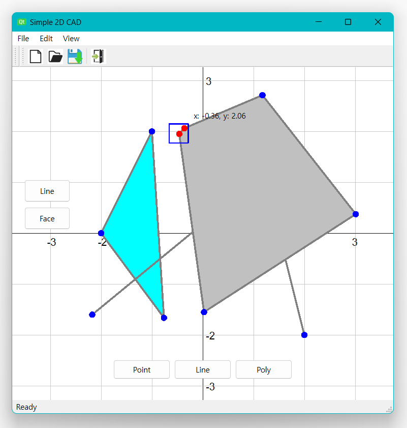

# Simple 2D CAD

## Result

## Object

- Practice project development skills
- Practice `C++`, `QT`, etc.
- Study project design pattern
- Apply coding convention

## Prerequisite

| Tool          | Version    |
| :---          | :------    |
| C++           | >= 17      |
| QT            | 6.6.0      |
| Visual Studio | 17.7.5     |
| OS            | Windows 11 |

## Implementation List

### Draw

- Draw Line
- Draw Face
- Using mouse left button

### Select

- (Default) Select Point
- Select Line
- Select Face
- Using mouse left button

### File I/O

- New scene
- Open scene (`.json`)
- Save scene (`.json`)

### Others

- Move (Pan)
- Zoom
- Using mouse right and wheel button
